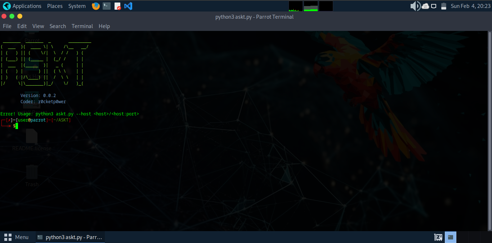

# Auto-Script Kiddies Tool

  
  
  
  
  

  
  
  
  

Usage: python3 --host 'full url'

Exemple: python3 --host http://127.0.0.1/index.php?id=0

***
# [~] Installation and Usage
* $ apt update
* $ apt upgrade
* $ pkg install git
* $ git clone https://github.com/r0cketp0wer/ASKT
* $ cd ASKT
* $ chmod a+x askt.py
***
Start tool: python3 askt.py

# Info

This program scans the site for vulnerabilities(SQL,XXS), finger admin panel and found site dirs. Perfect for ScriptKiddies😃 !!

### Stargazers

